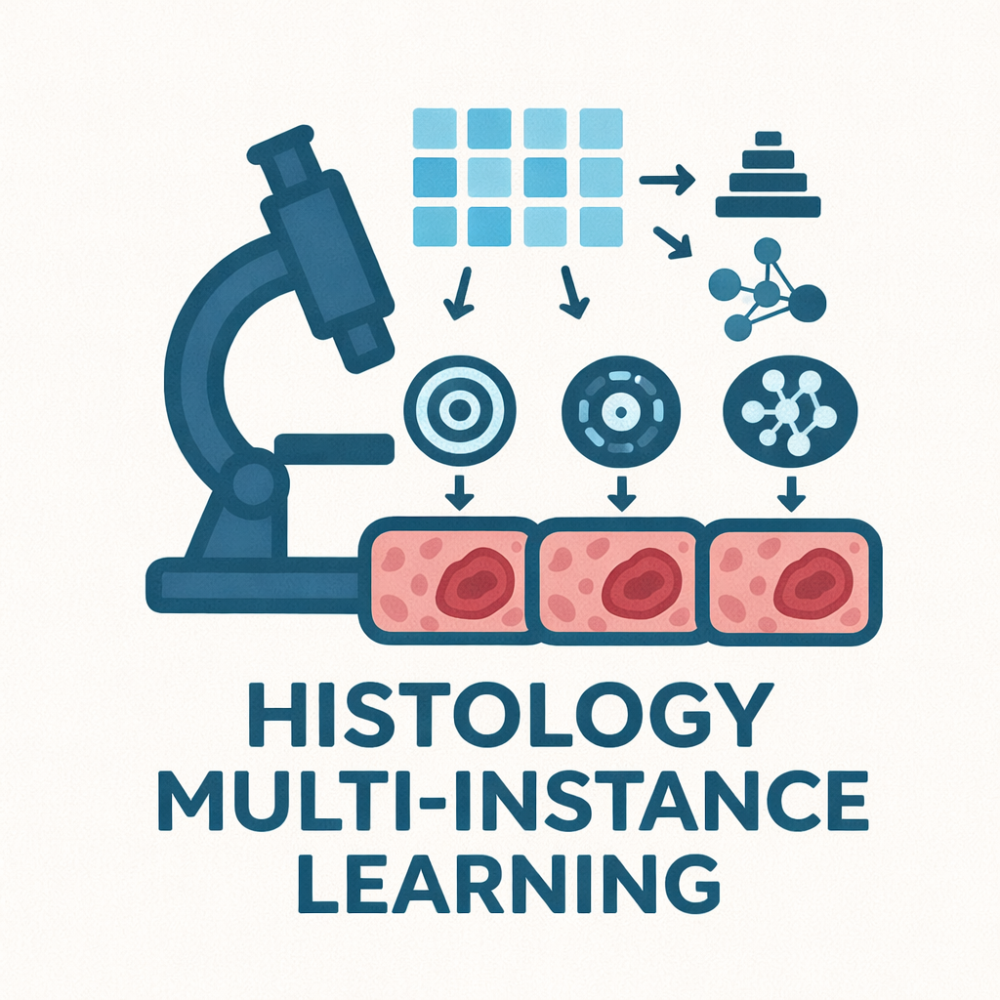

## HistologyMultiInstanceLearning

<p align="center">
  
</p>

**Multi-Instance Learning (MIL) pipeline** for histopathology to evaluate different **MIL architectures** (ABMIL, CLAM, DSMIL, etc.) using pre-extracted features from **foundation models** (for example, *uni_v2* and *virchow2*).

The workflow is implemented in **Nextflow DSL2** and runs on the host environment (micromamba + pip): Python tools from [HistoMILTrainer](https://github.com/digenoma-lab/HistoMILTrainer), R scripts for plots, and GDAL for heatmap TIFF export. No Singularity or Docker images are required.

The pipeline also supports **transfer learning from previously trained MIL checkpoints**, reusing the best hyperparameter configuration associated with each `feature_extractor × MIL architecture` combination.

---

### Pipeline overview

- **`main.nf`**  
  Orchestrates the pipeline:
  - Reads the clinical or dataset file from `params.dataset`.
  - Reads the list of feature extractors from `params/feature_extractors.csv`.
  - Reads the list of MIL architectures from `params/architectures.csv`.
  - Uses `params.features_dir` to construct the feature directory associated with each patch encoder.
  - Reads the training mode from `params.mode` (`grid` or `train`).
  - Uses `params.transfer_mode`, `params.checkpoint_results_dir`, and `params.best_params_dir` when `mode=train`.
  - Skips PNG/TIFF heatmaps when `params.heatmap` is `false` (attention scores are still produced by `predict`).
  - Launches:
    - `split_dataset`: splits the dataset into train, validation, and test folds at the case level.
    - `grid_search` (when `mode=grid`): hyperparameter grid search for each `feature_extractor × MIL architecture` combination.
    - `train` (when `mode=train`): training with fixed hyperparameters from a prior grid search or transfer-learning checkpoint.
    - `concat_results`: concatenates all test metrics into a single summary file.
    - `boxplot_auc`: generates a global ROC AUC boxplot.
    - `roc_auc_curve`: generates ROC AUC curves for each configuration.
    - `heatmap_workflow`:
      - `predict`: generates predictions and attention scores for each trained configuration.
      - `heatmap` (only if `params.heatmap=true`): creates heatmap visualizations for the highest-attention patches.
      - `convert_tiff` (only if `params.heatmap=true`): converts generated heatmaps to TIFF format.

- **`modules/grid_search.nf`**
  - `process split_dataset`: runs `histomil-splits` to create train, validation, and test splits at the case level.
  - `process grid_search`: runs `histomil-grid` for each `feature_extractor × MIL architecture` combination.
  - `process train`: runs `histomil-train` with fixed hyperparameters (`mode=train`).
  - Forwards the selected transfer mode and, when required, the resolved pretrained checkpoint and best-parameter configuration to HistoMILTrainer.
  - Publishes:
    - `test_results_*.csv`: test metrics for each fold.
    - `predictions_*.csv`: test predictions for each fold.
    - `best_params_*.json` and `*_best_model.pt` checkpoints.
  - `process concat_results`: concatenates all test metrics into `summary.csv`.

- **`modules/plots.nf`**
  - `process boxplot_auc`: generates a boxplot comparing ROC AUC across all configurations using `bin/boxplot_auc.R`.
  - `process roc_auc_curve`: generates ROC AUC curves using `bin/roc_auc_curve.R`.

- **`modules/heatmaps.nf`**
  - `process predict`: runs `histomil-predict` to generate predictions and attention scores using each trained model.
  - `process heatmap`: runs `histomil-heatmap` to visualize attention scores on slide images (skipped when `heatmap=false`).
  - `process convert_tiff`: converts generated heatmap images to tiled BigTIFF format using `gdal_translate` (skipped when `heatmap=false`).

- **`bin/`**
  - `boxplot_auc.R`: reads `summary.csv` and generates a ROC AUC boxplot comparing feature extractors and MIL architectures.
  - `roc_auc_curve.R`: plots ROC curves from model predictions.

---

### Inputs

- **Dataset file** (`params.dataset`)
  - CSV file with at least:
    - `case_id`: case or patient identifier used for case-level splitting.
    - `slide_id`: slide identifier used to locate the corresponding feature file.
    - Target column: column specified by `params.target`, for example `target`, `ESR1`, or `MKI67`.

  - Example:
    ```csv
    case_id,slide_id,target
    case_1,slide_1,0
    case_1,slide_2,0
    case_2,slide_3,1
    case_2,slide_4,1
    ```

- **Feature extractors configuration** (`params/feature_extractors.csv`)
  - CSV file loaded by the pipeline from the `params/` directory.
  - Required columns:
    - `patch_encoder`: patch-level encoder name, for example `uni_v2` or `virchow2`.
    - `patch_size`: patch size in pixels.
    - `mag`: magnification level.
    - `overlap`: overlap in pixels.

  - Example:
    ```csv
    patch_encoder,patch_size,mag,overlap
    uni_v2,256,20,0
    virchow2,224,20,0
    ```

- **MIL architectures configuration** (`params/architectures.csv`)
  - CSV file loaded by the pipeline from the `params/` directory.
  - Required column:
    - `architecture`: MIL architecture name.

  - Example:
    ```csv
    architecture
    abmil
    clam
    dsmil
    dftd
    ilra
    rrt
    transformer
    transmil
    wikg
    ```

- **Features directory** (`params.features_dir`)
  - Base directory where the pre-extracted feature directories are located.
  - Feature directories follow the pattern:

    ```text
    {features_dir}{mag}x_{patch_size}px_{overlap}px_overlap/features_{patch_encoder}/
    ```

  - Each feature directory should contain one `{slide_id}.h5` file per slide.
  - Each H5 file should contain:
    - `features`: array with shape `(num_patches, feature_dim)`.
    - `coords`: optional array containing patch coordinates.

- **Slides directory** (`params.slides_dir`)
  - Base directory where the whole-slide images are located.
  - This input is used by the heatmap workflow to associate attention scores with the corresponding WSI.

---

### Pipeline parameters

The YAML file selected through `-params-file` defines the execution-specific configuration. The principal parameters are:

- `dataset`: path to the CSV file containing `case_id`, `slide_id`, and the target column.
- `features_dir`: base directory containing the pre-extracted feature directories.
- `slides_dir`: base directory containing the WSIs (required for heatmap PNG/TIFF when `heatmap=true`).
- `outdir`: output directory for the execution.
- `target`: name of the target column.
- `task`: learning task. Currently, `"classification"` is supported.
- `folds`: number of cross-validation folds.
- `mode`: pipeline training stage — `grid` (hyperparameter search) or `train` (fixed hyperparameters / transfer learning).
- `heatmap`: if `true`, run `heatmap` and `convert_tiff`; if `false`, only `predict` (attention scores + predictions CSV).
- `transfer_mode`: used when `mode=train`. Accepted values are `scratch`, `head_only`, and `partial`.
- `best_params_dir`: directory containing `best_params_{feature_extractor}.{mil}.json` files (required for `mode=train` unless resolved from `checkpoint_results_dir`).
- `checkpoint_results_dir`: root directory containing `best_params/` and `models/` from a previous execution (required for `head_only` and `partial`).
- `checkpoint_fold`: fold used to select the pretrained checkpoint for transfer learning.

Example for grid search (`mode=grid`):

```yaml
dataset: "/path/to/class_dataset.csv"
features_dir: "/path/to/features/base/directory/"
slides_dir: "/path/to/slides/base/directory/"
outdir: "./results_grid/"
target: "target"
task: "classification"
folds: 10
mode: "grid"
heatmap: false
```

Example for scratch training with fixed hyperparameters (`mode=train`):

```yaml
dataset: "/path/to/class_dataset.csv"
features_dir: "/path/to/features/base/directory/"
slides_dir: "/path/to/slides/base/directory/"
outdir: "./results_train/"
target: "target"
task: "classification"
folds: 10
mode: "train"
transfer_mode: "scratch"
best_params_dir: "/path/to/prior_run/best_params/"
heatmap: false
```

Example for checkpoint-based transfer (`mode=train`):

```yaml
dataset: "/path/to/target_dataset.csv"
features_dir: "/path/to/target/features/"
slides_dir: "/path/to/target/slides/"
outdir: "./results_transfer/"
target: "target"
task: "classification"
folds: 10
mode: "train"
transfer_mode: "head_only"
checkpoint_results_dir: "/path/to/source/results/"
checkpoint_fold: 0
best_params_dir: "/path/to/source/results/best_params/"
heatmap: false
```

---

### Parameter flow from YAML to HistoMILTrainer

The YAML file contains both pipeline-level inputs and training parameters. Nextflow reads these values through `params` and forwards the relevant entries to the corresponding HistoMILTrainer command.

The expected flow is:

```text
YAML file
   ↓
Nextflow params
   ↓
main.nf
   ↓
modules/grid_search.nf
   ↓
histomil-grid
   ↓
HistoMILTrainer
```

The parameters are used as follows:

- `dataset`, `features_dir`, `target`, `task`, and `folds` define the training dataset and cross-validation procedure.
- `mode` selects whether the pipeline runs `histomil-grid` or `histomil-train`.
- `transfer_mode` determines whether the model is trained from scratch or initialized from a previous checkpoint (`mode=train` only).
- `checkpoint_results_dir` is interpreted as the root of the source execution for transfer learning.
- For `head_only` and `partial`, the pipeline resolves the architecture-specific best-parameter file and checkpoint using the current feature extractor, MIL architecture, and `checkpoint_fold`.
- `best_params_dir` supplies the JSON hyperparameter files for `mode=train`.
- `heatmap` controls whether PNG heatmaps and TIFF conversion are executed after `predict`.
- `slides_dir` is required when `heatmap=true`.
- `outdir` controls where Nextflow publishes the outputs of the current execution.

The exact HistoMILTrainer command-line options are assembled by the Nextflow modules. Therefore, YAML parameter names should remain synchronized with the parameters referenced in `main.nf` and `modules/grid_search.nf`.

---

### Transfer learning

When `mode=train`, the pipeline supports three training modes via `transfer_mode`:

- **`scratch`**: trains the selected MIL architecture from random initialization.
- **`head_only`**: loads compatible weights from a pretrained checkpoint and trains only the classification head or architecture-specific output heads.
- **`partial`**: loads a pretrained checkpoint and trains the architecture-specific subset of MIL layers configured in HistoMILTrainer.

The `partial` mode uses the trainable-module configuration defined for each MIL architecture in HistoMILTrainer.

For checkpoint-based modes, `checkpoint_results_dir` should contain the best parameters and model checkpoints generated by a previous pipeline execution:

```text
checkpoint_results_dir/
├── best_params/
│   └── best_params_{feature_extractor}.{mil}.json
└── models/
    └── {feature_extractor}.{mil}/
        └── {checkpoint_fold}_best_model.pt
```

The feature extractor and MIL architecture names used in the target execution must match the names used in the source execution. Otherwise, the pipeline will not be able to resolve the corresponding best-parameter file or pretrained model.

---

### Outputs

All outputs are written under `params.outdir`.

- **Training results**
  - `training/`
    - `summary.csv`: concatenated test metrics.
    - `{feature_extractor}.{mil}/`
      - `test_results_{feature_extractor}.{mil}.csv`: metrics for each fold.
    - Classification metrics include `test_auc`, `test_acc`, `test_f1`, `test_precision`, and `test_recall`.

- **Predictions**
  - `predictions/`
    - `{feature_extractor}.{mil}/`
      - `predictions_{feature_extractor}.{mil}_{fold}.csv`: predictions containing `slide_id`, `y_true`, `y_pred`, and `y_score`.

- **Best parameters and checkpoints**
  - `best_params/`
    - `best_params_{feature_extractor}.{mil}.json`
  - `models/{feature_extractor}.{mil}/`
    - `{fold}_best_model.pt`

- **Splits**
  - `splits/`
    - `{target}/`
      - `dataset.csv`.
      - `splits_{fold}_bool.csv`.
      - `splits_{fold}_descriptor.csv`.

- **Plots**
  - `plots/`
    - `boxplot.png`.
    - `*.roc_auc.png`.

- **Heatmaps**
  - `heatmaps/{feature_extractor}.{mil}/`
    - `attention_scores/`.
    - `predictions.csv`.
    - `topk_patches/`.
    - `tiff/`.

- **Pipeline information**
  - `pipeline_info/`: Nextflow timeline, report, trace, and DAG files.

---

### Requirements

- **Nextflow** ≥ 22.x (CI uses 25.10.2).
- **micromamba** or **conda** to create the runtime environment (recommended).
- **NVIDIA GPU** for training and prediction processes on the cluster (`kutral` profile requests `--gres=gpu:1`).
- A cluster with **SLURM** when using the `kutral` profile.
- [HistoMILTrainer](https://github.com/digenoma-lab/HistoMILTrainer) (installed via `environment.yml` or `requirements.txt`).

The default environment pins **PyTorch cu126** wheels for clusters whose NVIDIA driver supports CUDA 12.6 (for example, `ngen-ko` on Kutral). Adjust `torch`/`torchvision` pins in `environment.yml` if your driver requires a different CUDA build.

---

### Environment setup

The pipeline expects CLI tools on `PATH`: `histomil-grid`, `histomil-train`, `histomil-splits`, `histomil-predict`, `histomil-heatmap`, `Rscript`, and `gdal_translate`.

**Recommended (micromamba — Python, R, GDAL, and HistoMILTrainer):**

```bash
micromamba create -f environment.yml -n histomil-mil -y
micromamba activate histomil-mil
# Optional: pin CUDA wheels if a dependency upgraded torch
export PIP_EXTRA_INDEX_URL=https://download.pytorch.org/whl/cu126
pip install --force-reinstall torch==2.13.0+cu126 torchvision==0.28.0+cu126
```

**Pip only (Python tools; no R plots or GDAL unless installed separately):**

```bash
python -m venv .venv
source .venv/bin/activate
pip install -r requirements.txt
```

Activate the runtime environment in the same shell before launching Nextflow (and on cluster login nodes used for `nextflow run`). Slurm compute jobs must still find `histomil-*` on `PATH` — configure that via your cluster setup or Nextflow `beforeScript` if jobs fail with "command not found".

Verify GPU access after setup:

```bash
python -c "import torch; print(torch.__version__, torch.cuda.is_available())"
```

---

### Basic usage

1. Install the runtime environment (see [Environment setup](#environment-setup)).

2. Activate `histomil-mil` (and your Nextflow environment if separate).

3. Configure `params/feature_extractors.csv` and `params/architectures.csv`.

4. Create or edit a YAML params file under `params/` (committed stubs: `params_stub.yml`, `params_stub_train.yml`). Set paths, `mode`, `folds`, `heatmap`, and transfer-learning fields as needed.

5. Run the pipeline:

```bash
# Grid search on the cluster
nextflow run main.nf -profile kutral \
  -params-file params/params_stub.yml

# Transfer learning (mode=train)
nextflow run main.nf -profile kutral \
  -params-file params/params_stub_train.yml

# Local execution (no SLURM)
nextflow run main.nf -profile local \
  -params-file params/params_stub.yml

# Resume after interruption
nextflow run main.nf -profile kutral \
  -params-file params/your_params.yml \
  -resume

# CI / dry run without real execution
nextflow run main.nf -profile stub \
  -params-file params/params_stub.yml \
  -stub-run
```

---

### Supported MIL architectures

The pipeline supports multiple MIL architectures from [MIL-Lab](https://github.com/mahmoodlab/MIL-Lab):

- **ABMIL**: Attention-based Multiple Instance Learning.
- **CLAM**: Clustering-constrained Attention Multiple Instance Learning.
- **DSMIL**: Dual-stream Multiple Instance Learning.
- **DFTD**: Deep Feature-based Top-Down Attention.
- **ILRA**: Instance-Level Representation Aggregation.
- **RRT**: Residual Regression Transformer.
- **Transformer**: Transformer-based MIL.
- **TransMIL**: Transductive Multiple Instance Learning.
- **WIKG**: Weighted Instance Knowledge Graph.

Each architecture is configured through HistoMILTrainer JSON files in `histomil/configs/req_grid/`. These files also define the architecture-specific trainable modules used by `partial` transfer learning.

> **Note**: CLAM automatically sets `batch_size` to 1 during training. MIL-Lab is installed as a dependency of HistoMILTrainer.

---

### Output directory structure

```text
results/
├── splits/
│   └── {target}/
│       ├── dataset.csv
│       ├── splits_0_bool.csv
│       ├── splits_0_descriptor.csv
│       └── ...
├── training/
│   ├── summary.csv
│   ├── {feature_extractor}.{mil}/
│   │   └── test_results_{feature_extractor}.{mil}.csv
│   └── ...
├── best_params/
│   └── best_params_{feature_extractor}.{mil}.json
├── models/
│   └── {feature_extractor}.{mil}/
│       └── {fold}_best_model.pt
├── predictions/
│   ├── {feature_extractor}.{mil}/
│   │   ├── predictions_{feature_extractor}.{mil}_0.csv
│   │   ├── predictions_{feature_extractor}.{mil}_1.csv
│   │   └── ...
│   └── ...
├── plots/
│   ├── boxplot.png
│   └── *.roc_auc.png
├── heatmaps/
│   ├── {feature_extractor}.{mil}/
│   │   ├── attention_scores/
│   │   ├── predictions.csv
│   │   ├── topk_patches/
│   │   └── tiff/
│   └── ...
└── pipeline_info/
    ├── execution_report_*.html
    ├── execution_timeline_*.html
    ├── execution_trace_*.txt
    └── pipeline_dag_*.html
```

---

### Tips and best practices

1. Ensure that the `patch_encoder`, `patch_size`, `mag`, and `overlap` values in `params/feature_extractors.csv` match the physical directory structure under `features_dir`.

2. The dataset is split at the case level to prevent data leakage. Multiple slides from the same case remain in the same train, validation, or test partition.

3. Configure the number of cross-validation folds through `folds` in the selected YAML file.

4. Grid-search and train processes are memory- and GPU-intensive. Adjust resource allocations in `nextflow.config` when required. The `kutral` profile excludes node `wuruwe` from GPU jobs.

5. Use `-resume` to continue interrupted Nextflow executions.

6. Store pre-extracted features in H5 format, with one `{slide_id}.h5` file per slide. Ensure every slide in the dataset CSV has a matching feature file (filter invalid slides before training).

7. Keep the source execution's `best_params/` and `models/` directories under the same `checkpoint_results_dir`.

8. Preserve consistent feature extractor and MIL architecture names between source and target executions.

9. Keep execution-specific paths in YAML parameter files rather than hard-coding them in Nextflow modules or Trainer source code.

10. Launch Nextflow from an activated runtime environment; if Slurm jobs cannot find `histomil-grid`, add a `beforeScript` `PATH` export in `nextflow.config`.

---

### Citation

If you use this pipeline in your research, please cite:

- **MIL-Lab**: repository containing the MIL architectures used in this pipeline.
  - Repository: [https://github.com/mahmoodlab/MIL-Lab](https://github.com/mahmoodlab/MIL-Lab)

- **HistoMIL**: library used for training MIL architectures on histology data.
  - Repository: [https://github.com/digenoma-lab/HistoMIL](https://github.com/digenoma-lab/HistoMIL)

- **HistoMILTrainer**: CLI and training wrappers used by this Nextflow pipeline.
  - Repository: [https://github.com/digenoma-lab/HistoMILTrainer](https://github.com/digenoma-lab/HistoMILTrainer)

- **This pipeline**: cite this repository when using the complete Nextflow workflow.

---

### Contact

Author: **Gabriel Cabas**  
For questions or suggestions, open an *issue* or *pull request* in this repository.